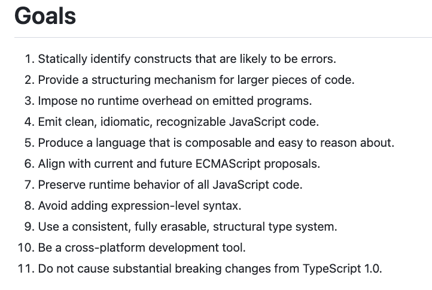

### BBC Typescript Training 03/23

#### Contents
...

#### 7 Primitive Types in JS
* Number
* String
* Boolean
* null
* undefined
* BigInt
* Symbol

#### TS Goals

#### Links
* [Typescript Playground](typescriptlang.org/play)
