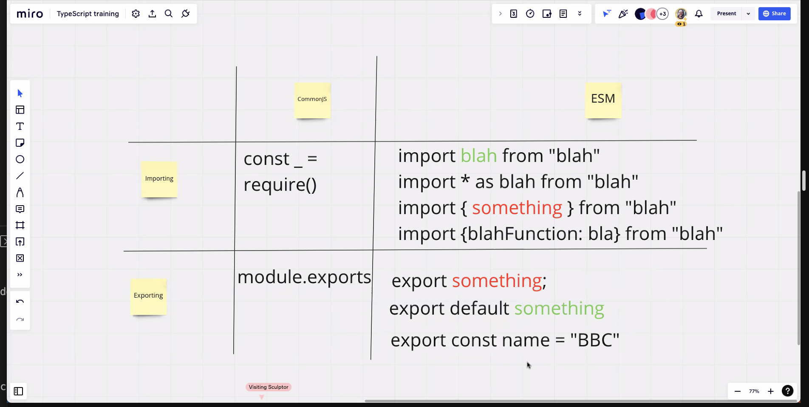

### BBC Typescript Training 03/23

#### Goals of Typescript


#### 7 Primitive Types in JS
* Number
* String
* Boolean
* null
* undefined
* BigInt
* Symbol

#### Imports and Exports


#### as vs is
* `as` is a [type assertion](https://www.typescriptlang.org/docs/handbook/basic-types.html#type-assertions)
* `is` is a [type predicate](https://www.typescriptlang.org/docs/handbook/advanced-types.html#using-type-predicates)

####
* Creating a Typescript React App:
```
npx create-react-app cra-app --template typescript
```

#### Links
* [Miro Board](https://miro.com/app/board/uXjVOiRglBM=/)
* [Typescript Playground](typescriptlang.org/play)
* [Type Guards Documentation](typescriptlang.org/docs/handbook/advanced-types.html)
* [Star Wars API](swapi.dev)
* [Docs for Fake API used in Lab 2](https://jsonplaceholder.typicode.com)
* [You Don't Know JS Books](https://github.com/getify/You-Dont-Know-JS)
* [Structured Clone Algorithm](https://developer.mozilla.org/en-US/docs/Web/API/Web_Workers_API/Structured_clone_algorithm)
* [Utility Types, for Type mapping](https://www.typescriptlang.org/docs/handbook/utility-types.html#picktype-keys)
* [Migrating from Javascript to Typescript](https://www.typescriptlang.org/docs/handbook/migrating-from-javascript.html)
* [Book on Functional Programming in JS](https://github.com/MostlyAdequate/mostly-adequate-guide)

[comment]: <> (todo: refer back to beginning of day 1 recording - 'typescript does 4 things' and add to readme)